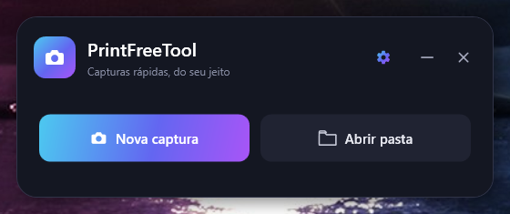
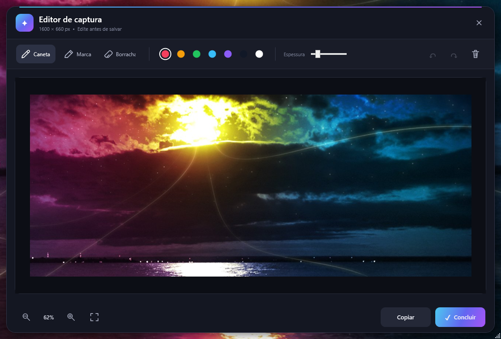
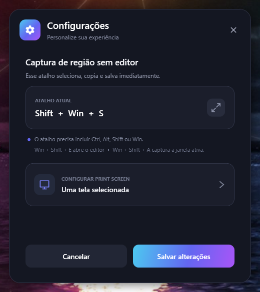
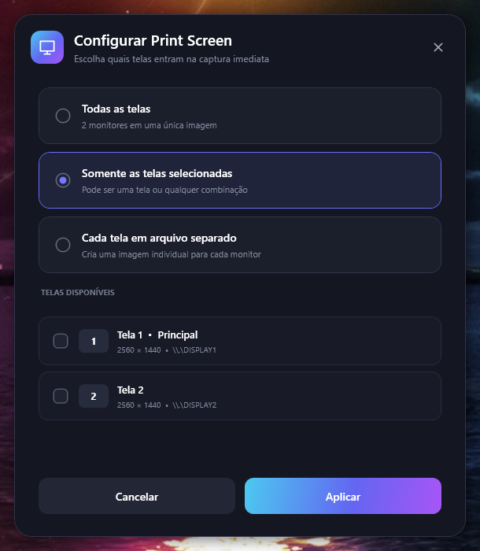

# PrintFreeTool

Aplicativo de captura de tela para Windows, feito em C# com WPF e executado em
segundo plano pela bandeja do sistema. As capturas são salvas automaticamente em
PNG e copiadas para a área de transferência.

## Interface

<p align="center">
  
</p>

### Editor integrado



### Configurações

<table>
  <tr>
    <td width="46%"></td>
    <td width="54%"></td>
  </tr>
  <tr>
    <td align="center">Atalhos e preferências</td>
    <td align="center">Captura em múltiplos monitores</td>
  </tr>
</table>

## Atalhos

| Atalho | Ação |
| --- | --- |
| `Win + Shift + S` | Seleciona uma região, salva e copia imediatamente. Pode ser alterado nas configurações. |
| `Win + Shift + E` | Seleciona uma região e abre o editor integrado. |
| `Win + Shift + A` | Captura somente a janela ativa, incluindo sua moldura visível. |
| `Print Screen` | Captura imediatamente os monitores definidos nas configurações. |

Durante a seleção de uma região, pressione `Esc` ou clique com o botão direito para
cancelar.

## Recursos

- inicialização oculta e acesso pelo ícone na bandeja;
- seleção de região em múltiplos monitores;
- editor com caneta, marca-texto, borracha, cores e controle de espessura;
- desfazer, refazer, limpar marcações, copiar e concluir;
- zoom pela roda do mouse ou pelos botões de lupa;
- navegação da imagem ampliada pelas setas do teclado e barras de rolagem estilizadas;
- captura da janela ativa com Windows Graphics Capture e fallback pela área visível;
- aviso quando a janela devolve uma imagem vazia ou bloqueada, o que pode indicar DRM;
- configuração do `Print Screen` para todas as telas, monitores selecionados ou um
  arquivo PNG separado para cada monitor.

No modo de arquivos separados, a tela principal também é copiada para a área de
transferência.

## Requisitos

- Windows 10 versão 2004 (build 19041) ou mais recente;
- .NET 8 SDK para compilar o projeto;
- .NET 8 Desktop Runtime para executar uma publicação dependente do framework.

## Desenvolvimento

Restaure as dependências e compile:

```powershell
dotnet restore .\PrintFreeTool.csproj
dotnet build .\PrintFreeTool.csproj -c Release
```

Para executar a partir do código-fonte:

```powershell
dotnet run --project .\PrintFreeTool.csproj
```

## Publicação

Para gerar um executável único de 64 bits, dependente do .NET 8 Desktop Runtime:

```powershell
dotnet publish .\PrintFreeTool.csproj -c Release -r win-x64 --self-contained false -p:PublishSingleFile=true -o .\dist
```

O executável será criado em `dist\PrintFreeTool.exe`. A pasta `dist` é um artefato
local e não faz parte do repositório.

## Dados locais

- capturas: `%USERPROFILE%\Pictures\PrintFreeTool`;
- configurações: `%LOCALAPPDATA%\PrintFreeTool\settings.json`.

Esses dados são criados somente durante o uso e não são versionados.

## Limitações

Aplicativos com conteúdo protegido podem impedir a captura ou retornar uma imagem
vazia. O PrintFreeTool detecta esses casos comuns, exibe uma notificação e evita
salvar o quadro vazio, mas a detecção depende do comportamento da janela e do
Windows.

## Licença

Este projeto é software livre distribuído sob a [licença MIT](LICENSE).
